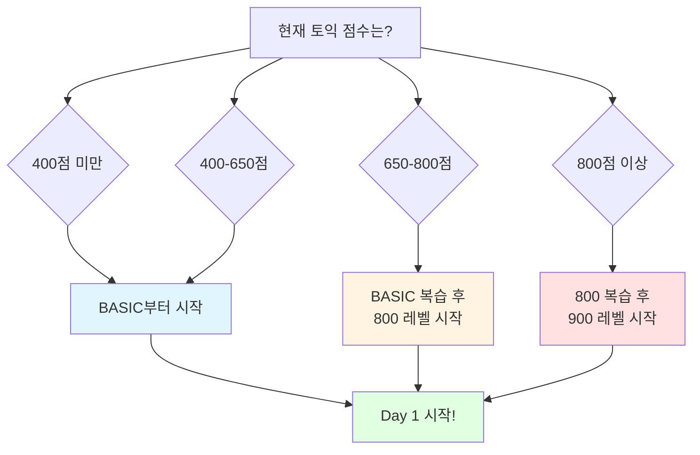

# 📚 TOEIC Vocabulary Master

> 토익 점수대별 필수 단어 완전 정복 - 체계적이고 효율적인 단어 학습 시스템

<div align="center">


[📖 시작하기](#-빠른-시작) • [📚 레벨별 학습](#-레벨별-학습-과정) • [🎯 학습 전략](#-학습-전략) • [🔗 빠른 참조](#-빠른-참조)

</div>

---

## 🎯 프로젝트 소개

**토익 점수대별로 최적화된** 단어 학습 프로그램입니다.
**BASIC(~700점) → 800점 → 900점+** 단계별로 구성되어 있으며, 각 레벨마다 **30일 완성 커리큘럼**을 제공합니다.

### ✨ 특징

<table>
<tr>
<td width="50%">

#### 📖 **점수대별 최적화**
- BASIC: 토익 ~700점 목표
- 800: 토익 800점 목표
- 900: 토익 900점+ 목표

</td>
<td width="50%">

#### 🎓 **30일 완성 시스템**
- 각 레벨당 30일 커리큘럼
- 하루 40개 단어 학습
- 주제별 체계적 분류

</td>
</tr>
<tr>
<td width="50%">

#### 💡 **풍부한 학습 자료**
- 단어당 3개 예문
- 발음 기호 포함
- 토익 빈출 표현 정리

</td>
<td width="50%">

#### ✅ **실전 중심 학습**
- 품사별 정리
- 핵심 의미 강조
- 토익 출제 패턴 분석

</td>
</tr>
</table>

---

## 🚀 빠른 시작

### 📊 나에게 맞는 레벨 찾기



### 🎯 레벨별 추천 학습 경로

| 현재 점수 | 추천 경로 | 예상 기간 |
|:--------:|---------|:--------:|
| **~500점** | BASIC (30일) | 1개월 |
| **500-650점** | BASIC (30일) | 1개월 |
| **650-750점** | BASIC (20일) → 800 (30일) | 1.5개월 |
| **750-850점** | 800 (30일) | 1개월 |
| **850점+** | 800 복습 (10일) → 900 (30일) | 1.5개월 |

👉 **[지금 바로 시작하기 →](#-레벨별-학습-과정)**

---

## 📚 레벨별 학습 과정

### 🟦 BASIC Level (~700점 목표)

> **대상**: 토익 입문자, 기초 단어 정립 필요자  
> **목표**: 토익 기본 단어 1,200개 완벽 습득  
> **기간**: 30일 (하루 40단어)

<details open>
<summary><b>📋 BASIC 커리큘럼 (30일)</b></summary>

#### Week 1: 업무 기초 (Day 1-7)
| Day | 주제 | 단어 수 | 바로 가기                                  |
|:---:|-----|:------:|----------------------------------------|
| 1 | 사무실 | 40 | [📝 Day 1](vocabulary/basic/day-01.md) |
| 2 | 서류 업무 | 40 | [📝 Day 2](vocabulary/basic/day-02.md) |
| 3 | 고용 | 40 | [📝 Day 3](vocabulary/basic/day-03.md) |
| 4 | 급여·복리후생 | 40 | [📝 Day 4](vocabulary/basic/day-04.md) |
| 5 | 사무용품 | 40 | [📝 Day 5](vocabulary/basic/day-05.md) |
| 6 | 경영 | 40 | [📝 Day 6](vocabulary/basic/day-06.md) |
| 7 | 회의 | 40 | [📝 Day 7](vocabulary/basic/day-07.md) |

#### Week 2: 비즈니스 활동 (Day 8-14)
| Day | 주제 | 단어 수 | 바로 가기                                   |
|:---:|-----|:------:|-----------------------------------------|
| 8 | 계약 | 40 | [📝 Day 8](vocabulary/basic/day-08.md)  |
| 9 | 마케팅 | 40 | [📝 Day 9](vocabulary/basic/day-09.md)  |
| 10 | 광고 | 40 | [📝 Day 10](vocabulary/basic/day-10.md) |
| 11 | 사업 | 40 | [📝 Day 11](vocabulary/basic/day-11.md) |
| 12 | 제조 | 40 | [📝 Day 12](vocabulary/basic/day-12.md) |
| 13 | 품질 관리 | 40 | [📝 Day 13](vocabulary/basic/day-13.md) |
| 14 | 구매 | 40 | [📝 Day 14](vocabulary/basic/day-14.md) |

#### Week 3: 무역 & 재무 (Day 15-21)
| Day | 주제 | 단어 수 | 바로 가기                                   |
|:---:|-----|:------:|-----------------------------------------|
| 15 | 주문·배송 | 40 | [📝 Day 15](vocabulary/basic/day-15.md) |
| 16 | 상거래 | 40 | [📝 Day 16](vocabulary/basic/day-16.md) |
| 17 | 무역·수출입 | 40 | [📝 Day 17](vocabulary/basic/day-17.md) |
| 18 | 숙박·식당 | 40 | [📝 Day 18](vocabulary/basic/day-18.md) |
| 19 | 수익 | 40 | [📝 Day 19](vocabulary/basic/day-19.md) |
| 20 | 회계 | 40 | [📝 Day 20](vocabulary/basic/day-20.md) |
| 21 | 회사동향 | 40 | [📝 Day 21](vocabulary/basic/day-21.md) |

#### Week 4: 일상 & 환경 (Day 22-30)
| Day | 주제 | 단어 수 | 바로 가기                                   |
|:---:|-----|:------:|-----------------------------------------|
| 22 | 미팅 | 40 | [📝 Day 22](vocabulary/basic/day-22.md) |
| 23 | 사원 복지 | 40 | [📝 Day 23](vocabulary/basic/day-23.md) |
| 24 | 인사이동 | 40 | [📝 Day 24](vocabulary/basic/day-24.md) |
| 25 | 교통 | 40 | [📝 Day 25](vocabulary/basic/day-25.md) |
| 26 | 은행 | 40 | [📝 Day 26](vocabulary/basic/day-26.md) |
| 27 | 투자 | 40 | [📝 Day 27](vocabulary/basic/day-27.md) |
| 28 | 건물·주택 | 40 | [📝 Day 28](vocabulary/basic/day-28.md) |
| 29 | 환경 | 40 | [📝 Day 29](vocabulary/basic/day-29.md) |
| 30 | 건강 | 40 | [📝 Day 30](vocabulary/basic/day-30.md) |

**✅ 총 1,200 단어 | 📖 3,600 예문 | ⏱️ 30일 완성**

</details>

---

### 🟨 800 Level (800점 목표)

> **대상**: BASIC 완료자, 토익 700점대  
> **목표**: 중급 단어 1,200개 추가 습득  
> **기간**: 30일 (하루 40단어)

<details>
<summary><b>📋 800 커리큘럼 (30일) - 클릭하여 펼치기</b></summary>

#### 📌 상세 커리큘럼
30일간의 체계적인 중급 단어 학습 과정이 준비되어 있습니다.

| Week | 주제 범위 | 특징 |
|:----:|---------|------|
| Week 1 | 비즈니스 심화 | 계약, 협상, 전략 관련 |
| Week 2 | 기술 & 혁신 | IT, 기술 발전 관련 |
| Week 3 | 금융 & 경제 | 투자, 시장 분석 관련 |
| Week 4 | 글로벌 이슈 | 국제 무역, 환경 관련 |

**✅ 총 1,200 단어 | 📖 3,600 예문 | ⏱️ 30일 완성**

</details>

---

### 🟥 900 Level (900점+ 목표)

> **대상**: 800 Level 완료자, 토익 850점+  
> **목표**: 고급 단어 1,200개 완벽 습득  
> **기간**: 30일 (하루 40단어)

<details>
<summary><b>📋 900 커리큘럼 (30일) - 클릭하여 펼치기</b></summary>

#### 📌 상세 커리큘럼
30일간의 고급 단어 심화 학습 과정이 준비되어 있습니다.

| Week | 주제 범위 | 특징 |
|:----:|---------|------|
| Week 1 | 전문 용어 | 법률, 의학 전문 용어 |
| Week 2 | 학술 어휘 | 논문, 연구 관련 |
| Week 3 | 고급 표현 | 격식체, 문어체 표현 |
| Week 4 | 관용 표현 | 숙어, 고급 구문 |

**✅ 총 1,200 단어 | 📖 3,600 예문 | ⏱️ 30일 완성**

</details>

---

## 🎯 학습 전략

### 📅 일일 학습 플랜

<table>
<tr>
<th width="33%">🌅 기본 플랜<br/>(30분/일)</th>
<th width="33%">🎯 집중 플랜<br/>(1시간/일)</th>
<th width="33%">💪 완벽 플랜<br/>(1.5시간/일)</th>
</tr>
<tr>
<td valign="top">

**학습 방법**
- ✅ 단어 40개 훑어보기
- ✅ 핵심 의미 암기
- ✅ 토익 빈출 표현 확인

**복습**
- 📝 당일 복습 1회

**예상 성과**
- 기본 의미 파악
- 70-80% 암기율

</td>
<td valign="top">

**학습 방법**
- ✅ 단어 40개 정독
- ✅ 예문 2회 읽기
- ✅ 토익 표현 암기
- ✅ 헷갈리는 단어 정리

**복습**
- 📝 당일 복습 2회
- 📝 전날 복습 1회

**예상 성과**
- 문맥 이해
- 85-90% 암기율

</td>
<td valign="top">

**학습 방법**
- ✅ 단어 40개 완벽 숙지
- ✅ 예문 3회 읽기
- ✅ 예문 작성 연습
- ✅ 발음 연습
- ✅ 오답 노트 작성

**복습**
- 📝 당일 복습 3회
- 📝 전날 복습 2회
- 📝 주간 복습 1회

**예상 성과**
- 완벽 습득
- 95%+ 암기율

</td>
</tr>
</table>

---

### 🔄 효과적인 암기 방법

#### 1️⃣ **간격 반복 학습** (Spaced Repetition)
```
Day 1: 새 단어 학습
Day 2: Day 1 복습 + 새 단어 학습
Day 3: Day 1-2 복습 + 새 단어 학습
Day 7: Day 1-6 주간 복습
Day 30: 전체 복습
```

#### 2️⃣ **문맥 중심 학습**
```
❌ 단어만 암기: afford - 여유가 있다
✅ 예문으로 암기: I can't afford this car. (이 차를 살 여유가 없다)
```

#### 3️⃣ **연상 기억법**
```
예시: decline (거절하다, 감소하다)
→ "de(아래로) + cline(기울다)" 
→ 아래로 기울다 → 거절하다/감소하다
```

---

## 🔗 빠른 참조

### 📌 추가 학습 자료

#### 📚 보충 자료
- [📄 자주 헷갈리는 단어](resources/frequently-confused.md) - 비슷한 단어 완벽 비교
- [📄 암기 팁 모음](resources/memorization-tips.md) - 효과적인 암기법
- [📄 학습 가이드](resources/study-guide.md) - 상세 학습 전략

#### 🎯 토익 필수 패턴

<details>
<summary><b>클릭하여 펼치기</b></summary>

##### 1. 동사 + 전치사 패턴
```
look for (찾다)
look after (돌보다)
look into (조사하다)
```

##### 2. make/take/give 조합
```
make a decision (결정하다)
take a break (휴식하다)
give a presentation (발표하다)
```

##### 3. 시간 전치사
```
at + 시각 (at 9 AM)
on + 요일/날짜 (on Monday)
in + 월/년 (in January)
```

##### 4. 장소 전치사
```
at + 지점 (at the office)
in + 공간 (in the building)
on + 표면 (on the desk)
```

</details>

---

## 📊 학습 통계

### 🎯 레벨별 통계

| Level | 단어 수 | 예문 수 | 학습 기간 | 난이도 |
|:-----:|:------:|:------:|:--------:|:------:|
| **BASIC** | 1,200 | 3,600 | 30일 | ⭐⭐ |
| **800** | 1,200 | 3,600 | 30일 | ⭐⭐⭐ |
| **900** | 1,200 | 3,600 | 30일 | ⭐⭐⭐⭐⭐ |
| **합계** | **3,600** | **10,800** | **90일** | - |

### 📈 예상 학습 성과

```
BASIC 완료 → 토익 700점 달성 가능
800 완료 → 토익 800점 달성 가능
900 완료 → 토익 900점+ 달성 가능
```

---

## 🗂️ 프로젝트 구조

```
toeic-vocabulary-master/
├── 📄 README.md                          # 👈 지금 보고 있는 문서
├── 📄 LICENSE                            # MIT 라이선스
├── 📁 basic/                             # 🟦 BASIC Level (30일)
│   ├── day-01.md ... day-30.md          # 30개 파일
│   └── README.md                         # BASIC 가이드
├── 📁 advanced-800/                               # 🟨 800 Level (30일)
│   ├── day-01.md ... day-30.md          # 30개 파일
│   └── README.md                         # 800 가이드
├── 📁 advanced-900/                               # 🟥 900 Level (30일)
│   ├── day-01.md ... day-30.md          # 30개 파일
│   └── README.md                         # 900 가이드
└── 📁 docs/                              # 📚 추가 학습 자료
    ├── frequently-confused.md            # 헷갈리는 단어
    ├── word-list-all.md                  # 전체 단어 목록
    ├── category-business.md              # 카테고리별 단어
    ├── MEMORIZATION-TIPS.md              # 암기 팁
    └── STUDY-GUIDE.md                    # 학습 가이드
```

---

## 💡 학습 팁

### ✅ 성공적인 학습을 위한 10가지 원칙

1. **📅 매일 꾸준히** - 하루도 빠짐없이 학습하기
2. **🔁 복습이 핵심** - 새 단어 + 복습 병행
3. **📝 예문으로 암기** - 단어만 외우지 않기
4. **🎯 토익 표현 집중** - 빈출 표현 우선 암기
5. **📖 소리내어 읽기** - 발음과 함께 암기
6. **✍️ 직접 써보기** - 손으로 쓰면서 암기
7. **🔊 듣기 병행** - 발음 듣기 연습
8. **💬 활용하기** - 실제 문장 만들어보기
9. **📊 진도 체크** - 학습 현황 기록
10. **🎉 보상하기** - 목표 달성 시 자기 보상

---

### 🎯 레벨별 학습 전략

<table>
<tr>
<th>BASIC Level</th>
<th>800 Level</th>
<th>900 Level</th>
</tr>
<tr>
<td valign="top">

**집중 포인트**
- ✅ 기본 의미 완벽 숙지
- ✅ 핵심 예문 3개 암기
- ✅ 토익 빈출 표현 암기

**학습 방법**
- 반복이 최우선
- 여러 번 읽기
- 소리내어 읽기

**목표**
- 일상 영어 이해
- 토익 700점 달성

</td>
<td valign="top">

**집중 포인트**
- ✅ 유사어 구분
- ✅ 문맥별 의미 파악
- ✅ 콜로케이션 암기

**학습 방법**
- 문맥 중심 학습
- 유사어 비교 학습
- 실전 문제 풀이

**목표**
- 비즈니스 영어 활용
- 토익 800점 달성

</td>
<td valign="top">

**집중 포인트**
- ✅ 뉘앙스 차이 이해
- ✅ 고급 표현 활용
- ✅ 동의어 확장

**학습 방법**
- 심화 학습
- 다양한 표현 익히기
- 작문 연습

**목표**
- 원어민 수준 어휘
- 토익 900점+ 달성

</td>
</tr>
</table>

---

## 🤝 기여하기

이 프로젝트에 기여하고 싶으신가요?

### 기여 방법
1. 🍴 Fork the repository
2. 🔧 Create your feature branch (`git checkout -b feature/AmazingFeature`)
3. ✅ Commit your changes (`git commit -m 'Add some AmazingFeature'`)
4. 📤 Push to the branch (`git push origin feature/AmazingFeature`)
5. 🎉 Open a Pull Request

### 환영하는 기여
- ✅ 오탈자 수정
- ✅ 예문 추가/개선
- ✅ 추가 학습 자료
- ✅ 암기 팁 공유
- ✅ 번역 개선

---

## 📝 라이선스

이 프로젝트는 MIT 라이선스 하에 배포됩니다. 자세한 내용은 [LICENSE](LICENSE) 파일을 참조하세요.

---

## 💬 피드백 & 문의

### 📧 연락처
- **이메일**: ark182818@gmail.com
- **이슈**: [GitHub Issues](https://github.com/yourusername/toeic-vocabulary-master/issues)

### 🌟 도움이 되셨나요?
- ⭐ **Star**를 눌러주시면 큰 힘이 됩니다!
- 📢 주변에 **공유**해주세요!
- 💬 **피드백**을 남겨주세요!

---

<div align="center">

### 🎓 함께 토익 고득점을 달성해요!

**Made with ❤️ for TOEIC Learners**

---

### 📚 학습 시작하기

[](basic/day-01.md)
[](800/day-01.md)
[](900/day-01.md)

---

[⬆️ 맨 위로 가기](#-toeic-vocabulary-master)

</div>
